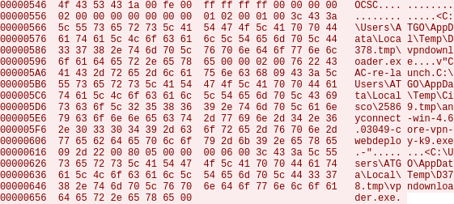
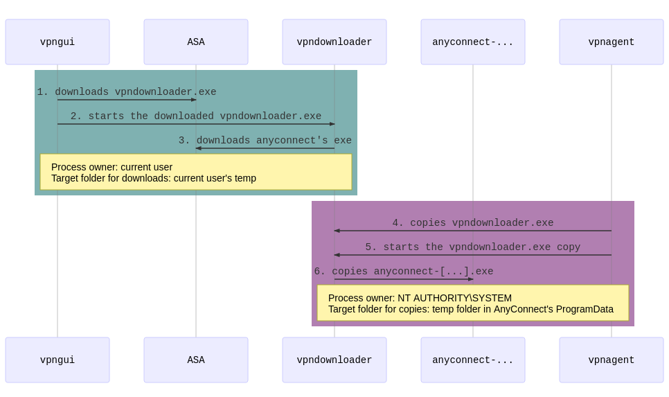
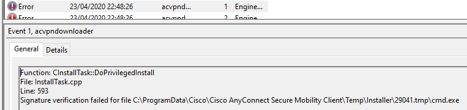
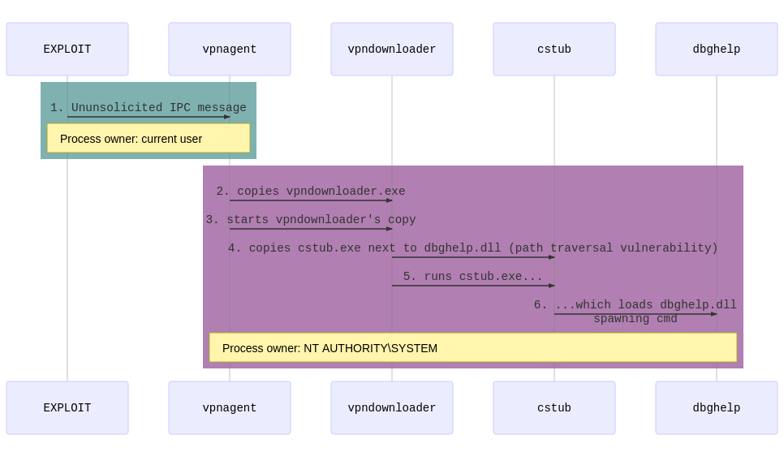
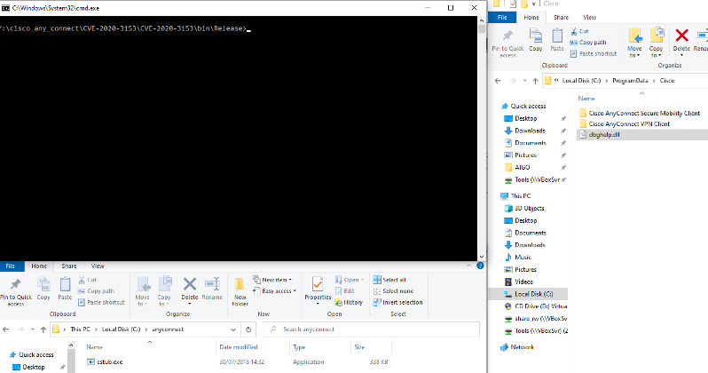
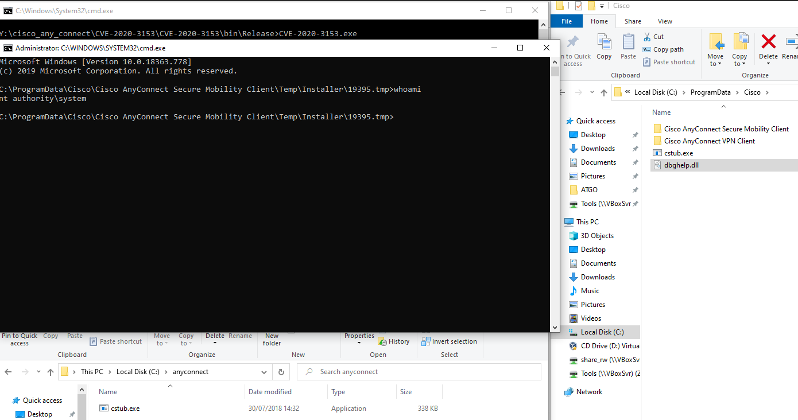
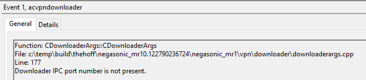
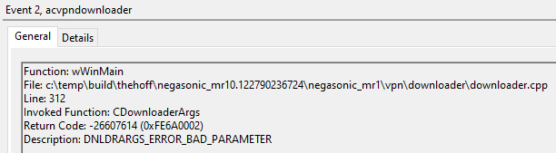
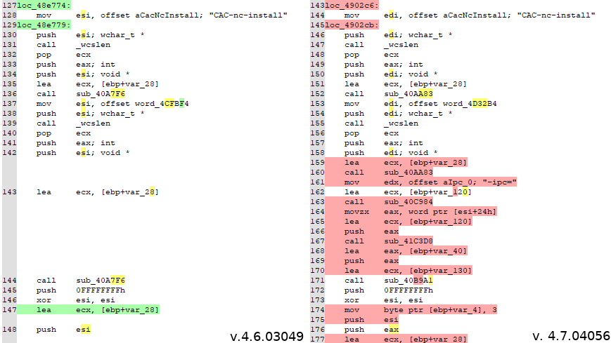

# Writing an exploit for CVE-2020-3153

## Table of Contents
1. [Introduction](#introduction)
2. [Disclaimer](#disclaimer)
3. [CVE-2020-3153 description](#cve-2020-3153-description)
4. [Cisco AnyConnect Auto-Update](#cisco-anyconnect-auto-update)
5. [AnyConnect IPC protocol](#anyconnect-ipc-protocol)
6. [Path traversal](#path-traversal)
7. [Privilege escalation through path traversal](#privilege-escalation-through-path-traversal)
8. [The "-ipc" parameter](#the-"-ipc"-parameter)
9. [Bonus: MSBuild launcher for CVE-2020-3153](#bonus-msbuild-launcher-for-cve-2020-3153)
10. [Going a bit further](#going-a-bit-further)
11. [References](#references)

## Introduction
[Cisco AnyConnect](https://www.cisco.com/c/en/us/products/security/anyconnect-secure-mobility-client/index.html) can be updated in several ways, in particular with an embedded auto-update feature. Such feature has already been affected by several privilege escalation vulnerabilities in the past few years. 

The purpose of this document is to detail the writing of an exploit for [CVE-2020-3153](https://tools.cisco.com/security/center/content/CiscoSecurityAdvisory/cisco-sa-ac-win-path-traverse-qO4HWBsj), a privilege escalation through path traversal in Cisco AnyConnect before version 4.8.02042.

## CVE-2020-3153 description

>A vulnerability in the installer component of Cisco AnyConnect Secure Mobility Client for Windows could allow an authenticated local attacker to copy user-supplied files to system level directories with system level privileges. The vulnerability is due to the incorrect handling of directory paths. An attacker could exploit this vulnerability by creating a malicious file and copying the file to a system directory. An exploit could allow the attacker to copy malicious files to arbitrary locations with system level privileges. This could include DLL pre-loading, DLL hijacking, and other related attacks. To exploit this vulnerability, the attacker needs valid credentials on the Windows system. 

## Disclaimer
- This research is based on auto-updates from AnyConnect 4.5.02036 to 4.6.03049. I did not have the opportunity to study an update to 4.7.x or 4.8.x versions but, as demonstrated, such versions are also impacted (before 4.8.02042).
- This research is exclusively focused on the practical exploitation of CVE-2020-3153, other potential vulnerabilities discovered during this exercise are yet to be thoroughly analysed.
- CVE-2020-3153 was discovered by [Yorick Koster](https://twitter.com/yorickkoster), I wanted to develop a working exploit based on the article from [SSD Secure Disclosure](https://ssd-disclosure.com/ssd-advisory-cisco-anyconnect-privilege-elevation-through-path-traversal/). 

## Cisco AnyConnect Auto-Update

According to the [Cisco documentation](https://www.cisco.com/c/en/us/td/docs/security/vpn_client/anyconnect/anyconnect40/administration/guide/b_AnyConnect_Administrator_Guide_4-0/deploy-anyconnect.html#ID-1425-0000044e), AnyConnect can be updated in several ways, and in particular using an auto-update feature:

>When AnyConnect connects to the ASA, the AnyConnect Downloader checks to see if any new software or profiles have been loaded on the ASA. It downloads those updates to the client, and the VPN tunnel is established. 

This feature is enabled or disabled in the client settings (VPN profile) file with this XML tag: 

`<AutoUpdate UserControllable="false">true</AutoUpdate>`

AnyConnect is composed of numerous executables and libraries but the two main components are: 

- `vpnagent.exe` – Cisco AnyConnect Secure Mobility Agent, a service running as Local System account; 
- `vpnui.exe` – AnyConnect GUI, running as the current logged user.

These two executables communicate with each other thanks to an Inter-Process Communication (IPC) mechanism on the TCP port 62522 (loopback network interface only).
It is then possible to capture the communications between the VPN agent and the GUI by sniffing the loopback interface with Wireshark. Since the content is not encrypted, the main purpose of each message can be guessed (e.g. update of a message, download of new settings, etc.). 

The capture below shows *one* of the numerous messages sent from the GUI to the agent during an auto-update: 

<p align="center">
  
</p>
Without knowing much about the binary protocol in use, we can still see several local paths and file names. For instance, and for the rest of this document, the current user is named `ATGO`. By using Sysinternals' Process Monitor (ProcMon) at the same time, numerous events are recorded but the following ones are the most important:

1.  `vpndownloader.exe` is downloaded by `vpnui.exe` (running as the current user, `ATGO`) from the ASA gateway to  `C:\Users\ATGO\AppData\Local\Temp\D378.tmp\vpndownloader.exe`

2. `vpndownloader.exe` (downloaded in step 1) is started with the current user (`ATGO`) privileges (process created by `vpnui.exe`) with the following command: `"C:\Users\ATGO\AppData\Local\Temp\D378.tmp\vpndownloader.exe" "-ipc	gc"` 

3. `anyconnect-win-4.6.03049-core-vpn-webdeploy-k9.exe` is downloaded (by `vpndownloader.exe`) from the ASA gateway to `C:\Users\ATGO\AppData\Local\Temp\Cisco\25869.tmp\anyconnect-win-4.6.03049-core-vpn-webdeploy-k9.exe`

4. `vpnagent.exe` copies `vpndownloader.exe` from `C:\Users\ATGO\AppData\Local\Temp\D378.tmp\vpndownloader.exe` to `C:\ProgramData\Cisco\Cisco AnyConnect Secure Mobility Client\Temp\Downloader\vpndownloader.exe`

5.  The copied `vpndownloader.exe` is started by `vpnagent.exe` as `NT AUTHORITY\SYSTEM` with the following command: 

    `"C:\ProgramData\Cisco\Cisco AnyConnect Secure Mobility Client\Temp\Downloader\vpndownloader.exe" "CAC-re-launch	C:\Users\ATGO\AppData\Local\Temp\Cisco\25869.tmp\anyconnect-win-4.6.03049-core-vpn-webdeploy-k9.exe	-" ` 

6. `anyconnect-win-4.6.03049-core-vpn-webdeploy-k9.exe` is copied to `C:\ProgramData\Cisco\Cisco AnyConnect Secure Mobility Client\Temp\Installer\23342.tmp\` and then the installation of AnyConnect 4.6.03049 begins.


These steps can be represented with the following diagram:

<p align="center">
  
</p>


It should be noted that:
- As mentioned in in the [disclaimer section](#disclaimer), this events are based on an auto-update from AnyConnect 4.5.02036 to 4.6.03049.
- All paths but the last one are present in the Wireshark capture. It means that only filenames from`C:\Users\ATGO\AppData\Local\Temp` path are parameters that the GUI send to the agent (no reference to`C:\ProgramData\Cisco\Cisco AnyConnect Secure Mobility Client\` in the Wireshark capture).
- `<xxx>.tmp` folders' names are random and they are cleaned after the update.
- Also, folders under `C:\ProgramData\Cisco\Cisco AnyConnect Secure Mobility Client\` are not user-writable. 

## AnyConnect IPC protocol

As mentioned in introduction, `vpndownloader.exe` has been affected by several vulnerabilities in the past years. The AnyConnect IPC protocol has already been studied, in particular in SerializingMe's article [part 1](https://www.serializing.me/2016/12/14/anyconnect-elevation-of-privileges-part-1/) and [part 2](https://www.serializing.me/2016/12/20/anyconnect-elevation-of-privileges-part-2/), and several exploits (ab)using this protocol were made available (e.g. [Google Project Zero PoC for CVE-2015-6305](https://bugs.chromium.org/p/project-zero/issues/detail?id=460)).

This protocol uses a Type-Length-Value (TLV) structure sent over TCP/62522. The previous Wireshark capture illustration can be parsed as follow:

```c
char packet[] = {
    0x4f, 0x43, 0x53, 0x43,                         // Signature ("OCSC")
    0x1a, 0x00,                                     // Message header length
    0xfe, 0x00,                                     // Message body length
    0xff, 0xff, 0xff, 0xff,                         // IPC response
    0x00, 0x00, 0x00, 0x00,                         // Message user context
    0x02, 0x00, 0x00, 0x00,                         // Request message identifier
    0x00, 0x00, 0x00, 0x00,                         // Return IPC object
    0x01, 0x02,                                     // Message type
   
   
    0x00, 0x01,                                     // Index
    0x00, 0x3c,                                     // Length
    
    //Value: C:\Users\ATGO\AppData\Local\Temp\D378.tmp\vpndownloader.exe
    0x43, 0x3a, 0x5c, 0x55, 0x73, 0x65, 0x72, 0x73,
    0x5c, 0x41, 0x54, 0x47, 0x4f, 0x5c, 0x41, 0x70,
    0x70, 0x44, 0x61, 0x74, 0x61, 0x5c, 0x4c, 0x6f,
    0x63, 0x61, 0x6c, 0x5c, 0x54, 0x65, 0x6d, 0x70,
    0x5c, 0x44, 0x33, 0x37, 0x38, 0x2e, 0x74, 0x6d,
    0x70, 0x5c, 0x76, 0x70, 0x6e, 0x64, 0x6f, 0x77,
    0x6e, 0x6c, 0x6f, 0x61, 0x64, 0x65, 0x72, 0x2e,
    0x65, 0x78, 0x65, 0x00,
    
    

    0x00, 0x02,                                     // Index
    0x00, 0x76,                                     // Length
    
    //Value: "CAC-re-launch\tC:\Users\ATGO\AppData\Local\Temp\Cisco\25869.tmp\anyconnect-win-4.6.03049-core-vpn-webdeploy-k9.exe\t-"
    0x22, 0x43, 0x41, 0x43, 0x2d, 0x72, 0x65, 0x2d, 
    0x6c, 0x61, 0x75, 0x6e, 0x63, 0x68, 0x09, 0x43, 
    0x3a, 0x5c, 0x55, 0x73, 0x65, 0x72, 0x73, 0x5c, 
    0x41, 0x54, 0x47, 0x4f, 0x5c, 0x41, 0x70, 0x70,
    0x44, 0x61, 0x74, 0x61, 0x5c, 0x4c, 0x6f, 0x63,
    0x61, 0x6c, 0x5c, 0x54, 0x65, 0x6d, 0x70, 0x5c, 
    0x43, 0x69, 0x73, 0x63, 0x6f, 0x5c, 0x32, 0x35, 
    0x38, 0x36, 0x39, 0x2e, 0x74, 0x6d, 0x70, 0x5c, 
    0x61, 0x6e, 0x79, 0x63, 0x6f, 0x6e, 0x6e, 0x65, 
    0x63, 0x74, 0x2d, 0x77, 0x69, 0x6e, 0x2d, 0x34, 
    0x2e, 0x36, 0x2e, 0x30, 0x33, 0x30, 0x34, 0x39, 
    0x2d, 0x63, 0x6f, 0x72, 0x65, 0x2d, 0x76, 0x70, 
    0x6e, 0x2d, 0x77, 0x65, 0x62, 0x64, 0x65, 0x70, 
    0x6c, 0x6f, 0x79, 0x2d, 0x6b, 0x39, 0x2e, 0x65, 
    0x78, 0x65, 0x09, 0x2d, 0x22, 0x00, 


    0x80, 0x05, 0x00, 0x00,                         // Use installed false

    0x00, 0x06,                                     // Index 
    0x00, 0x3c,                                     // Length 
    
    //Value: C:\Users\ATGO\AppData\Local\Temp\D378.tmp\vpndownloader.exe
    0x43, 0x3a, 0x5c, 0x55, 0x73, 0x65, 0x72, 0x73, 
    0x5c, 0x41, 0x54, 0x47, 0x4f, 0x5c, 0x41, 0x70, 
    0x70, 0x44, 0x61, 0x74, 0x61, 0x5c, 0x4c, 0x6f, 
    0x63, 0x61, 0x6c, 0x5c, 0x54, 0x65, 0x6d, 0x70, 
    0x5c, 0x44, 0x33, 0x37, 0x38, 0x2e, 0x74, 0x6d, 
    0x70, 0x5c, 0x76, 0x70, 0x6e, 0x64, 0x6f, 0x77, 
    0x6e, 0x6c, 0x6f, 0x61, 0x64, 0x65, 0x72, 0x2e, 
    0x65, 0x78, 0x65, 0x00 
};
```
It is important to note that this protocol is not encrypted and that the sender is not authenticated (no message signing). Consequently a local, unprivileged user can write and send arbitrary IPC messages through the loopback interface. 

By sending a TLV message with the path pointing to `cmd.exe` instead of `anyconnect-win-4.6.03049-core-vpn-webdeploy-k9.exe` and by following the events in ProcMon, we observe that the file `cmd.exe` is copied to `C:\ProgramData\Cisco\Cisco AnyConnect Secure Mobility Client\Temp\Installer\xxxxx.tmp\`. However, `cmd.exe` is **not** executed and the following error appears in the Windows Event Viewer:

<p align="center">
  
</p>

This behaviour is expected since binaries need to be signed by Cisco (Cisco Systems, Inc.).

## Path traversal

In the vulnerability advisory, the author mentions that:

>A path traversal vulnerability exists in the step where the (user-supplied) executable is copied into the temporary folder. vpndownloader.exe will extract the target file name from the source file name. Essentially it does this by searching for the last occurrence of the backslash (\\) character in the source path, the right part after the backslash is treated as the file name and is used as the target file name. AnyConnect does not take into account that the Windows API also accepts the forward slash (/) as directory separator character. Because of this it is possible to cause vpndownloader.exe to create files outside its temporary folder.

Based on ProcMon events (see [Cisco AnyConnect Auto-Update section](#cisco-anyconnect-auto-update)), the previous quote and the fact that all paths except `C:\ProgramData\Cisco\Cisco AnyConnect Secure Mobility Client\Temp\Installer\xxxxx.tmp\` are present in the IPC messages, I concluded that the vulnerability lies in the way `vpndownloader.exe` will parse its arguments:

 `"CAC-re-launch	C:\Users\ATGO\AppData\Local\Temp\Cisco\25869.tmp\anyconnect-[...]-k9.exe	-"`

Indeed, by replacing the string: `C:\Users\ATGO\AppData\Local\Temp\Cisco\25869.tmp\anyconnect-[...]-k9.exe` with: `C:\myOwnPath\nope\nope\nope\nope\../../../../anyconnect.exe`.

Then the `anyconnect.exe` file (whose actual path is `C:\myOwnPath\anyconnect.exe`) is moved to `C:\ProgramData\Cisco\` **instead of** `C:\ProgramData\Cisco\Cisco AnyConnect Secure Mobility Client\Temp\Installer\xxxxx.tmp\`, because the file name that was considered by `vpndownloader` is "`../../../../anyconnect.exe`". Hence the 4-level folders traversal. 

At this stage, we can write arbitrary files anywhere on the drive since the move operation is done with high privileges (at this step, `vpndownloader` is launched by `vpnagent`). In addition, if the moved file is a binary signed by Cisco, it is run as `NT AUTHORITY\SYSTEM` by the `vpnagent` service. The next section shows how these two issues can be combined to develop a stable privilege escalation exploit.

## Privilege escalation

### Side note on vpndownloader "commands"

By performing some basic reverse engineering on `vpndownloader.exe`, the following "CAC" (for  <u>C</u>isco <u>A</u>ny<u>C</u>onnect?) commands can be found:

- `CAC-move`
- `CAC-vcredist-install`
- `CAC-re-launch`
- `CAC-nc-install`

The first command seems to be used to move (replace) a client XML settings file (VPN profile). Based on the name of the next command, it may/might be used to install Visual C++ Redistributable packages. I found that *at least* `CAC-re-launch`, `CAC-nc-install` and`CAC-vcredist-install`,  commands are vulnerable to the path traversal issue. 

I decided to use `CAC-nc-install` because it happened to be more reliable.

### Exploitation through DLL hijacking

As mentioned in the [author's advisory](https://www.securify.nl/advisory/SFY20200419/cisco-anyconnect-elevation-of-privileges-due-to-insecure-handling-of-path-names.html) and in the [SSD Advisory](https://ssd-disclosure.com/ssd-advisory-cisco-anyconnect-privilege-elevation-through-path-traversal/), `cstub.exe` (a host-scan utility) is a Cisco signed binary that is affected by a DLL hijacking vulnerability: `cstub.exe` looks for a DLL named `dbghelp.dll`.

Therefore, my work-in-progress exploit has been modified to move the legitimate (signed) `cstub.exe` to a location where a standard user could have dropped a rogue `dbghelp.dll` (DLL planting). 

Standard users do not have write access in `C:\ProgramData\Cisco\Cisco AnyConnect Secure Mobility Client` and its sub-folders. However they can, for instance, write in `C:\ProgramData\Cisco\`.

To simplify my code, I chose to have the path to `cstub.exe` hard-coded to "`C:\anyconnect\cstub.exe`". Therefore, for my exploit to work, `cstub.exe` must already be in `C:\anyconnect\` and `dbghelp.dll` in `C:\ProgramData\Cisco\`.

The rogue `dbghelp.dll` spawns an elevated command prompt, I reused the one from [Google Project Zero PoC for CVE-2015-6305](https://bugs.chromium.org/p/project-zero/issues/detail?id=460).

Here is what happens when the exploit runs:
1. The exploit code sends an (unsolicited) IPC message with a `CAC-nc-install` command and the following string: `C:\anyconnect\nope\nope\nope\nope\../../../../cstub.exe`
2. `vpnagent.exe` copies `vpndownloader.exe` from `C:\Program Files (x86)\Cisco\Cisco AnyConnect Secure Mobility Client\vpndownloader.exe` (this path to `vpndownloader` is indicated in our IPC message) to `C:\ProgramData\Cisco\Cisco AnyConnect Secure Mobility Client\Temp\Downloader\vpndC:\ProgramData\Cisco\Cisco AnyConnect Secure Mobility Client\Temp\Downloader\vpndownloader.exe`
3. The copied `vpndownloader.exe` is started by `vpnagent.exe` as `NT AUTHORITY\SYSTEM` with  argument the `CAC-nc-install` command sent by the exploit.
4. `vpndownloader.exe` copies `C:\anyconnect\cstub.exe` to `C:\ProgramData\Cisco\cstub.exe` (path traversal with 4 levels above the original path, just next to the rogue `dbghelp.dll`). It should be noted, we use the `vpndownloader.exe` binary located in AnyConnect's Program Files.
5. `cstub.exe` is executed as `NT AUTHORITY\SYSTEM` and loads the malicious `dbghelp.dll` (DLL hijacking)
6. The code in `dbghelp.dll` is executed with the local system account: an elevated command prompt spawns on the desktop of the regular user.


These steps can be represented with the following diagram:

<p align="center">
  
</p>


Before execution:

<p align="center">
  
</p>


After execution:
<p align="center">
  
</p>


## The "-ipc" parameter

The developed PoC was successful on AnyConnect 4.5.02036 and 4.6.03049. However, it failed on AnyConnect 4.7.x and 4.8.x (before 4.8.02042).

By looking at ProcMon, `cstub.exe` binary was not copied to `C:\ProgramData\Cisco\` and the following errors were logged in the Windows Event Viewer.

<p align="center">
  
</p>

<p align="center">
  
</p>

By "diffing" `vpndownloader.exe` 4.6.03049 and 4.7.04056, the following changes can be identified (in red are the  changes added in version 4.7.x):


<p align="center">
  
</p>

Based on this information and the previous errors messages, the `CAC-nc-install` command must be modified to add a `-ipc=` parameter. At this stage I did not know the expected value, but I thought it was probably an integer ("Downloader IPC **port number** not present").

The [original security advisory's author](https://twitter.com/yorickkoster/status/1253663893500694528) confirmed that the expected value is an integer. He told me that, he used the value 65222 in his exploit (the TCP port number used for IPC). As far as we know, it can be any number. He supposes this parameter is used as a callback mechanism. Later, I studied the `CAC-move` command (used to move client XML settings files) on a 4.8.x installation and I saw `-ipc=1844`. 
In all cases, this parameter could have been extracted from an 4.7.x/4.8.x auto-update message capture on the loopback interface. 

Thus, with `-ipc=1337`, or any other port number, (followed by a "tab" character ) added in the unsolicited `CAC-nc-install` command, the exploit is also successful on AnyConnect 4.7.x and 4.8.x (before 4.8.02042).

It should be noted that the `-ipc` parameter is not supported by older versions of AnyConnect. Therefore, my exploit begins by checking the installed version of AnyConnect before writing the malicious IPC message.

## Bonus: MSBuild launcher for CVE-2020-3153

I wrote an MSBuild launcher for my C# exploit code to use in case of Application Whitelisting or just to change the path to `vpndownloader.exe` or `cstub.exe` without having to recompile the C# code.

Only a few modifications must be performed on the C# source code to be integrated in an XML formatted project file:
- the class must inherits Task and implements ITask interface (`public class Program :  Task, ITask`)
- the main function of the program must be:  `public override bool Execute()` (and returns a boolean)
- `Microsoft.Build.Framework` and `Microsoft.Build.Utilities` must be added in the import list

```xml
<Project ToolsVersion="4.0" xmlns="http://schemas.microsoft.com/developer/msbuild/2003">
  <!-- MSBuild launcher for CVE-2020-3153 -->
  <!-- Usage: C:\Windows\Microsoft.Net\Framework64\v4.0.30319\MSBuild.exe c:\path\to\CVE-2020-3153.xml -->
   
  <Target Name="CVE-2020-3153-Build">
   <Program />
  </Target>
<UsingTask
    TaskName="Program"
    TaskFactory="CodeTaskFactory"
    AssemblyFile="C:\Windows\Microsoft.Net\Framework64\v4.0.30319\Microsoft.Build.Tasks.v4.0.dll" >
    <ParameterGroup/>
    <Task>
        <Code Type="Class" Language="cs">
            <![CDATA[
                using Microsoft.Build.Framework;
                using Microsoft.Build.Utilities;
		
                // C# program here

            ]]>
        </Code>
    </Task>
    </UsingTask>
</Project>
```

## Going a bit further
By digging a bit, I noted that `vpndownloader.exe` is also a Cisco signed binary that is affected by the same DLL hijacking vulnerability.

Therefore, I modified my exploit to use `vpndownloader.exe` instead of `cstub.exe`. In addition, I embedded `dbghelp.dll` in Base64 in my  code.


## References

- [Cisco documentation](https://www.cisco.com/c/en/us/td/docs/security/vpn_client/anyconnect/anyconnect40/administration/guide/b_AnyConnect_Administrator_Guide_4-0/deploy-anyconnect.html#ID-1425-0000044e)
- [Original advisory](https://www.securify.nl/advisory/SFY20200419/cisco-anyconnect-elevation-of-privileges-due-to-insecure-handling-of-path-names.html)
- [SSD Advisory](https://ssd-disclosure.com/ssd-advisory-cisco-anyconnect-privilege-elevation-through-path-traversal/)
- [Cisco Security Advisory](https://tools.cisco.com/security/center/content/CiscoSecurityAdvisory/cisco-sa-ac-win-path-traverse-qO4HWBsj)
- SerializingMe article [part 1](https://www.serializing.me/2016/12/14/anyconnect-elevation-of-privileges-part-1/) and [part 2](https://www.serializing.me/2016/12/20/anyconnect-elevation-of-privileges-part-2/)
- [Google Project Zero PoC for CVE-2015-6305](https://bugs.chromium.org/p/project-zero/issues/detail?id=460)
