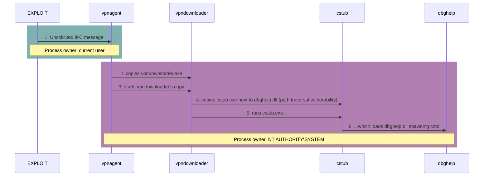

 ```mermaid
sequenceDiagram
    rect rgba(0,100,100,0.5)
        vpngui->>ASA: 1. downloads vpndownloader.exe
        vpngui->>vpndownloader: 2. starts the downloaded vpndownloader.exe
        vpndownloader->>ASA: 3. downloads anyconnect's exe
        Note over vpngui,vpndownloader: Process owner: current user<br/>Target folder for downloads: current user's temp 
    end
    
    rect rgba(100,0,100,0.5)
        participant A as anyconnect-...
        vpnagent->>vpndownloader: 4. copies vpndownloader.exe
        vpnagent->>vpndownloader: 5. starts the vpndownloader.exe copy
        vpndownloader->>A: 6. copies anyconnect-[...].exe
        Note over vpndownloader,vpnagent: Process owner: NT AUTHORITY\SYSTEM <br/>Target folder for copies: temp folder in AnyConnect's ProgramData
     end
 ```


